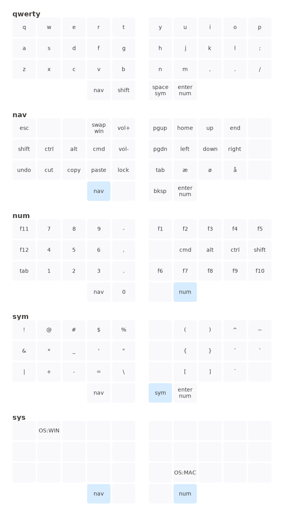

# Userspace 34-key layout
This is my take on a 34-key layout. I made it in [QMK userspace](https://docs.qmk.fm/#/feature_userspace?id=userspace-sharing-code-between-keymaps) so it can be reused for different keyboards. I use it on my Planck keyboard and for my Ferris Sweep.    

I use [Callum style mods](https://github.com/callum-oakley/qmk_firmware/tree/master/users/callum) mods. I have tried to use [OSM](https://docs.qmk.fm/#/one_shot_keys?id=one-shot-keys) but I had some issues when using multiple modifiers together - it works better with Callum style mods. 

